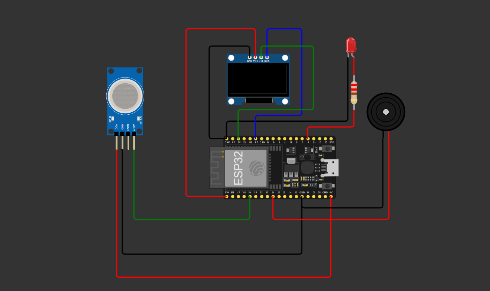
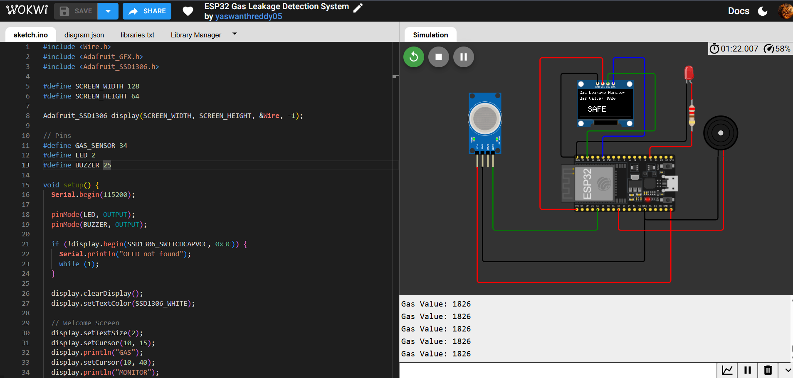
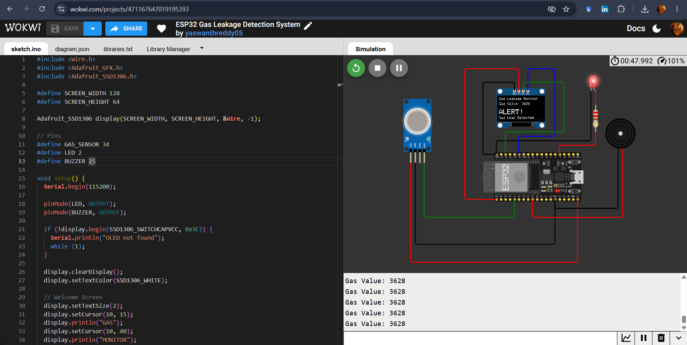

# ESP32 Gas Leakage Detection and Alert System

## 📌 Project Overview
This project is an ESP32-based Gas Leakage Detection and Alert System developed using the Wokwi simulator. It continuously monitors gas levels using an MQ-2 gas sensor and alerts users through an OLED display, LED, and buzzer when the gas concentration exceeds a predefined threshold.

## 🚀 Features
- Real-time gas monitoring
- OLED display for gas level
- LED indication
- Buzzer alarm for gas leakage
- ESP32 microcontroller
- Wokwi simulation

## 🛠 Components Used
- ESP32
- MQ-2 Gas Sensor
- SSD1306 OLED Display
- LED
- Buzzer
- Jumper Wires

## 💻 Software Used
- Arduino IDE
- Wokwi Simulator

## 📂 Project Files
- sketch.ino
- diagram.json
- libraries.txt

## ▶️ How to Run
1. Open the project in Wokwi.
2. Start the simulation.
3. Adjust the MQ-2 gas sensor level.
4. Observe the OLED display, LED, and buzzer response.

## 📸 Project Preview
*(Upload screenshots here after creating this README.)*

## 👨‍💻 Author
**Yaswanth Reddy**
## Project Images

### Circuit Diagram

### SAFE Mode

### ALERT Mode

